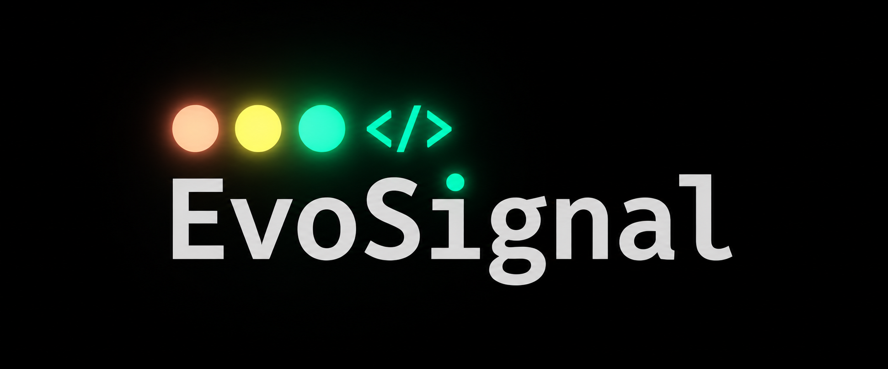
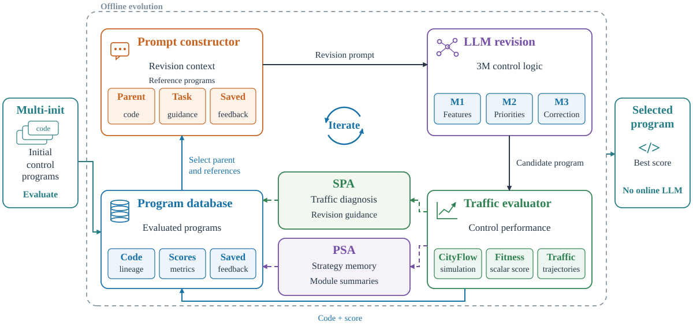
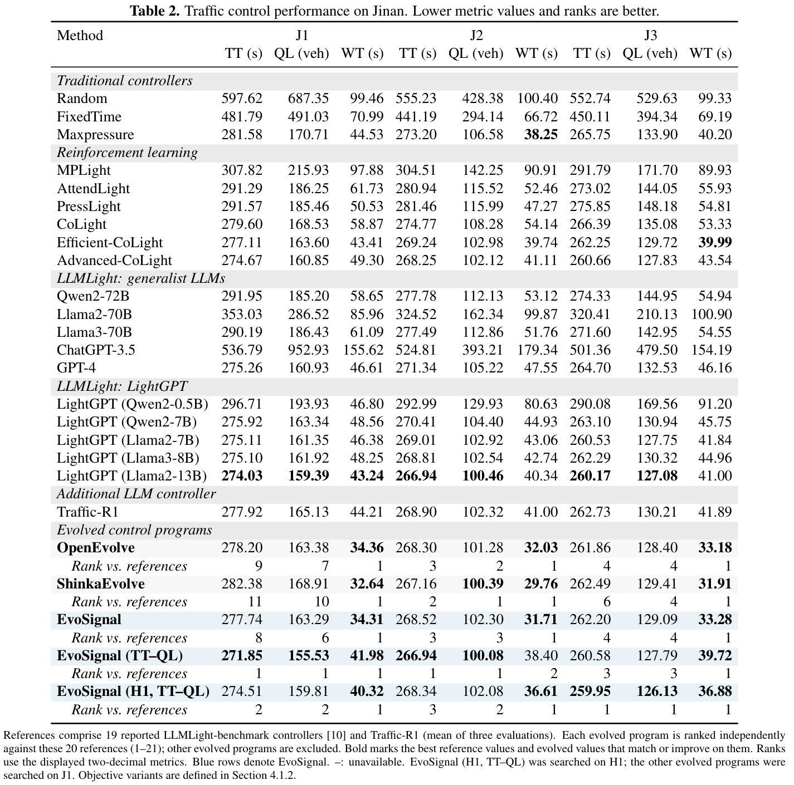
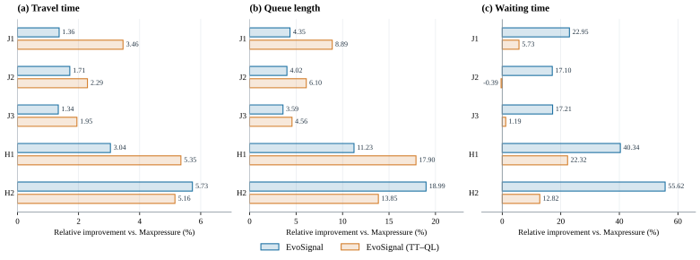
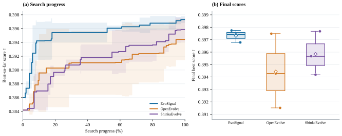

  <a href="README.md">English</a> | <a href="README_zh.md">简体中文</a>

  

  <strong>大语言模型引导的模块化交通信号控制程序进化设计</strong>

EvoSignal 在**离线设计阶段**利用大语言模型改进可检查的交通信号控制程序。选定的程序直接根据交通观测选择相位，**在线运行时无需调用大语言模型**。

> **论文展示版。** 本仓库目前只提供研究介绍和图表。预印本公开后会补充 arXiv 链接；完整代码与复现材料计划在论文接收后发布。

## 研究动机：让自适应控制规则仍然可检查

交通需求和路网会变化，反复人工调整控制规则费时。强化学习从交通经验中学习自适应策略，大模型控制器则引入预训练知识和语言推理。EvoSignal 在程序设计阶段利用大模型能力，根据交通运行反馈修订**显式交通特征计算与控制规则**，部署时直接执行选定程序。

| 能力 | 传统信号控制 | 强化学习控制 | 大模型控制 | EvoSignal |
| :--- | :---: | :---: | :---: | :---: |
| 从经验或反馈中学习自适应控制策略 | ✗ | ✓ | ✓ | ✓ |
| 在设计或决策中利用预训练大模型知识 | ✗ | ✗ | ✓ | ✓ |
| 支持在线推理并提供自然语言解释 | ✗ | ✗ | ✓ | ✗ |
| 自动修订显式交通特征计算 | ✗ | ✗ | ✗ | ✓ |
| 自动修订显式控制规则 | ✗ | ✗ | ✗ | ✓ |
| 可执行决策逻辑可供人工检查和编辑 | ✓ | ✗ | ✗ | ✓ |
| 在线无需神经模型推理（含大模型） | ✓ | ✗ | ✗ | ✓ |

*✓ 表示支持；✗ 表示不属于该类代表性方法的设定。传统控制指预设规则，能够响应交通变化，但不因此学习新策略；强化学习控制指神经网络策略。大模型控制包括 LightGPT、Traffic-R1 等利用交通反馈训练的模型。*

*特征修订指改变显式特征定义及计算；可检查的决策逻辑指连接交通特征与控制决策的可读条件和公式。策略学习发生在训练或程序设计阶段；“在线”指部署时的相位选择。*

## 方法概览

*论文图 2。多策略初始化（Multi-init）提供起点；三模块程序包含交通特征（M1）、局部相位优先级（M2）及可选的路网感知修正（M3）。仿真性能分析（SPA）诊断交通行为，帕累托策略档案（PSA）保留不同性能权衡的策略，为后续修订提供参考。选定程序在线运行时不调用大模型。*

## 论文中的主要结果

- **等待时间：**在两个真实路网的五个场景中，默认选定程序的等待时间比各场景 **20 个传统、强化学习和大模型基线中的最低等待时间**降低 **16.8–49.2%**。
- **跨场景迁移：**侧重行程时间与排队长度的程序在 J1 搜索场景的三项指标上均优于全部 20 个基线；未经修改迁移到其余四个场景后，每项指标仍排在前三。

*论文表 2，济南（J1–J3）。TT 为行程时间，QL 为排队长度，WT 为等待时间，数值越低越好。每个进化程序均单独与相同的 20 个基线比较排名；浅蓝色行表示 EvoSignal 程序。其余两个场景见[表 3：杭州（H1–H2）](assets/figures/table-3-hangzhou.png)。*

*论文图 4。行程时间、排队长度和等待时间相对 **Maxpressure** 的改善，正值表示更优。两个程序均在 J1 进化，并原样用于其他场景。这里的参照对象是 Maxpressure；上文 16.8–49.2% 的参照对象则是每个场景中 20 个基线的最低等待时间。*

*论文图 5。在 J1 的默认目标下比较搜索进程和最终最优得分，每种框架运行三次。实验设置、波动范围、消融实验和完整基线表见论文。*

[实验设置图](assets/figures/experimental-setup.svg)展示了研究所用路网、可选相位和交通需求曲线。

## 论文与代码

**论文：** *EvoSignal: LLM-Guided Evolutionary Design of Modular Traffic Signal Control Programs*。预印本发布后补充 arXiv 链接及引用信息。

**代码：** 实现与复现教程计划在论文接收后发布。本展示版仓库暂不包含可运行的实现。
